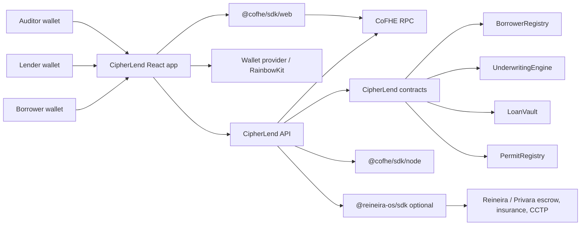
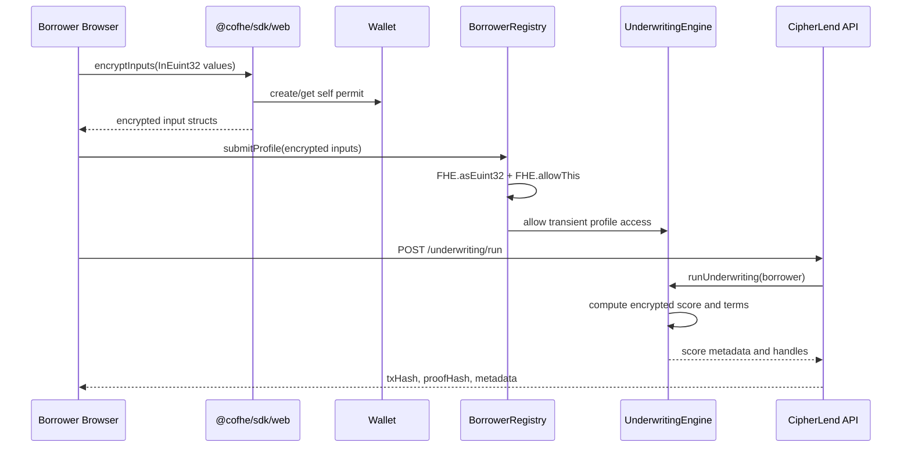
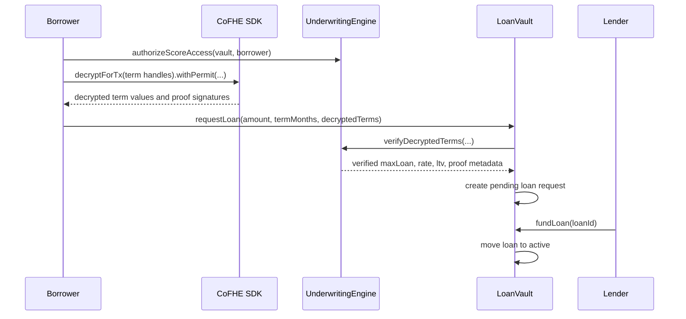
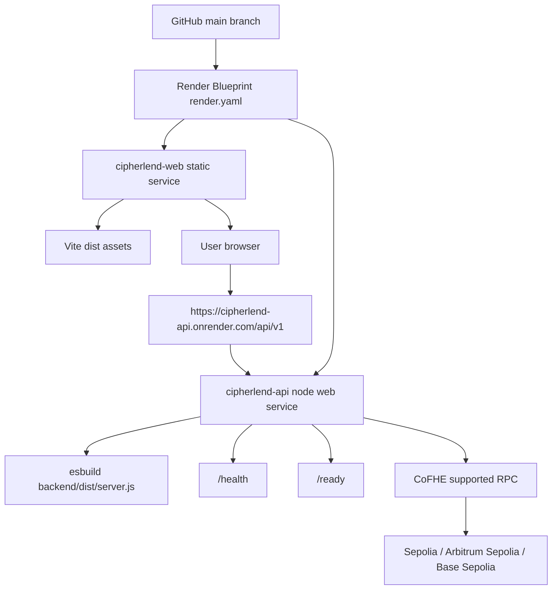

# CipherLend Architecture

## System Context

## Encrypted Borrower Profile Flow

## Proof-Gated Loan Flow

## Render Deployment Topology

## Contract Boundaries

- `BorrowerRegistry` owns encrypted borrower profile state and profile access authorization.
- `UnderwritingEngine` computes encrypted scores and terms and verifies CoFHE decrypt-for-transaction proofs.
- `LoanVault` owns loan request, funding, payment, overdue, and covenant lifecycle.
- `PermitRegistry` tracks business-level data grants. It does not replace CoFHE SDK permits.
- Reineira integration is an optional API boundary for settlement-side escrow and insurance workflows. It is disabled unless `REINEIRA_ENABLED=true`.

## Production Trust Boundaries

- Raw borrower financial values should exist only in the borrower browser session before encryption.
- The API should not accept raw borrower financial values in production flows.
- CoFHE SDK permits authorize ciphertext decryption. `PermitRegistry` only records application-level grants.
- Backend signer authority must be isolated to a dedicated operational wallet with limited funds and monitored transactions.
- Render environment variables are the deployment control plane. Never commit live RPC secrets, private keys, or deployed private addresses into the repository.
